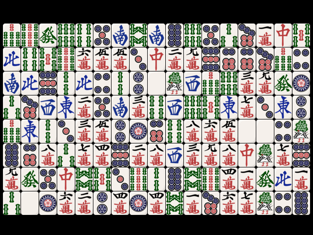

# Shisen-Sho

Simple Shisen-Sho game.




## Prerequisites

* [Meson](https://mesonbuild.com/)
* [SDL2](https://www.libsdl.org/)
* [fmt](https://fmt.dev/latest/)


## Build

```sh
$ mkdir build
$ meson setup build
$ ninja -C build
```


## Control

|             |        |
| -           | -      |
| left-click  | pick   |
| right-click | cancel |
| h           | hint   |
| q           | quit   |
| r           | reset  |


## Credits

* "[riichi-mahjong-tiles](https://github.com/FluffyStuff/riichi-mahjong-tiles)"
  by [@FluffyStuff](https://github.com/FluffyStuff) is licensed under
  [CC BY 4.0](https://creativecommons.org/licenses/by/4.0/)
